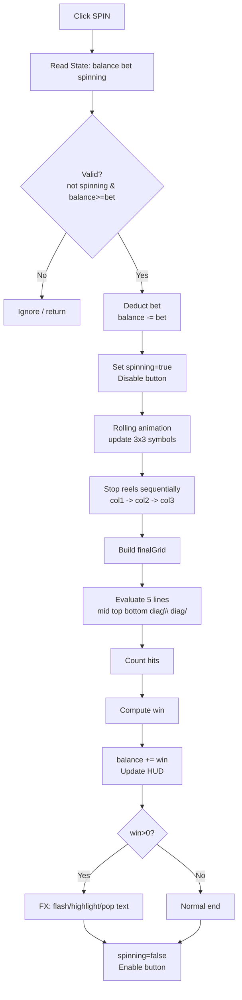
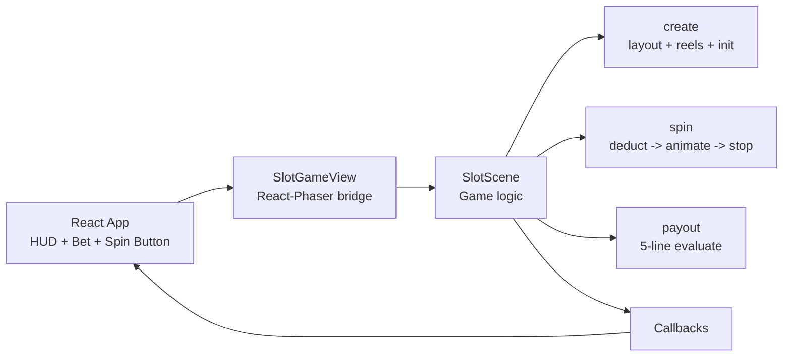

# Slot Demo Flow

## 1) Spin Runtime Flow

---

## 2) Architecture Flow

---

## 3) Core State

- `balance`: current coins
- `bet`: wager per spin
- `spinning`: lock state for spin action
- `finalGrid[3][3]`: resolved symbols for settlement
- `hits`: number of winning lines
- `win`: payout amount of current spin
